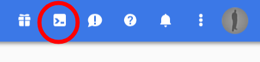
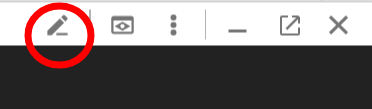
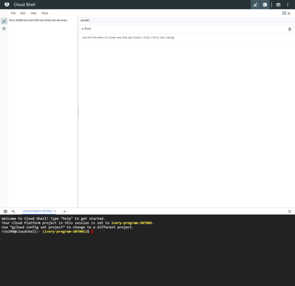

# Getting Started

## Requirements

For this workshop you will require:

* A Google Account
* A free, 12 months, $300 Google Cloud Platform Credit
* A valid credit card is need. 
  * It will not be charged. Even if you somehow go over the $300 mark, without your further approval.

## Creating A Google Account

_Note: Skip this step, if you have a Google Account, such as Gmail and have not used your $300 Google Cloud Platform offer._

1. In your browser, preferably Google Chrome \(as it's the one we have tested\), go to [https://accounts.google.com/SignUp?hl=ga](https://accounts.google.com/SignUp?hl=ga)
2. Follow the steps to create an account.

## Claiming 12 Months, $300 Google Cloud Platform Credit

_Note: If you have done this before and have used up the credit, the best way is to create another, new account._

1. Go to your Google Cloud Platform Console [https://console.cloud.google.com/home/dashboard](https://console.cloud.google.com/home/dashboard)
2. At the top you should see the 12 months, $300 offer link. Follow it.
3. Follow the steps and accept the agreements.
4. Enter your contact and credit card information when required.

## Google Cloud Shell and Code Editor

For this workshop we are using a the Google Cloud Shell and Code Editor. The reasons for this are:

1. Demonstrate the Shell and the Editor.
2. Keep everyone on the same platform and avoid troubleshooting individual environments and OSs.
3. Same instructions will apply to everyone.
4. Only a Browser is needed to complete this workshop.

## Opening the Google Cloud Shell

Open the Google Cloud Shell using the symbol in the illustration, that can be found in the right top corner.

## Opening the Code Editor

Open the Code Editor using the symbol in the illustration, that can be found along right top side of the Cloud Shell.

You should now be looking at a browser tab that looks like the illustration. The Code Editor at the top and the Shell at the bottom.

## About Google Cloud Shell

Welcome to Google Cloud Shell, a tool for managing resources hosted on Google Cloud Platform! The machine comes pre-installed with the Google Cloud SDK and other popular developer tools.

Your 5GB home directory will persist across sessions, but the VM is ephemeral and will be reset approximately 20 minutes after your session ends. No system-wide change will persist beyond that.

Conclusion. Your files are safe, but there is no sense in installing anything as you normally would. We will help you deal with this.

## Create a Bastion Server Manualy

Lets see how a VM instance is created manualy. Although automation is great there are times when it is just faster.

Navigate to the [VM instances](https://console.cloud.google.com/compute/instances) in the Google Cloud Console.

Click the "create" button.

In the "instance name" type "bastion". 

Under "Boot Disk" click "Change". Select "CentOS 7" as "os image". Change "Boot disk type" to "SSD persistent disk".

Before you click "create", at the very bottom of the screen click "command line" in the "Equivalent REST or command line" sentence. Then copy the contents.

Now click the "create" button.

Once the server is created. Using the three dot menu beside it, choose "delete".

## Create a Bastion Server Using Command Line

Return to the Google Cloud Shell.

Paste the contents of your clipboard on the command line and hit enter.

You are watching the VM instance being created.

## Next

[Terraform](2-terrafrom.md)
